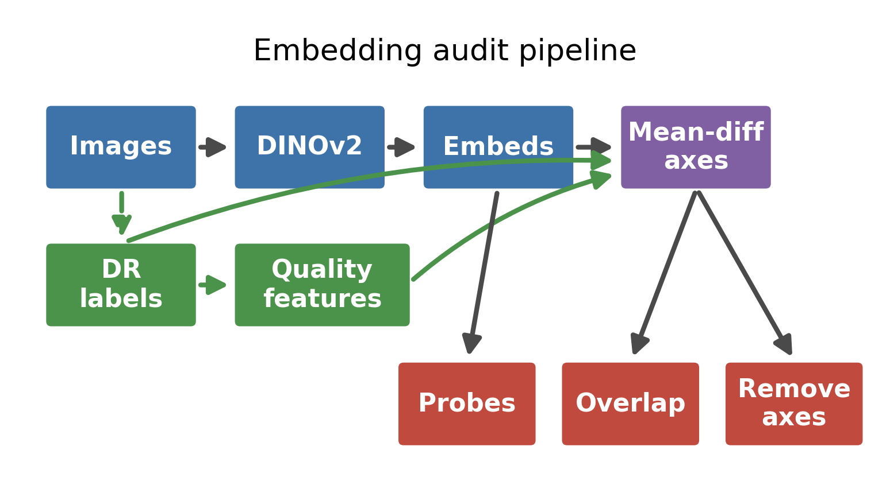
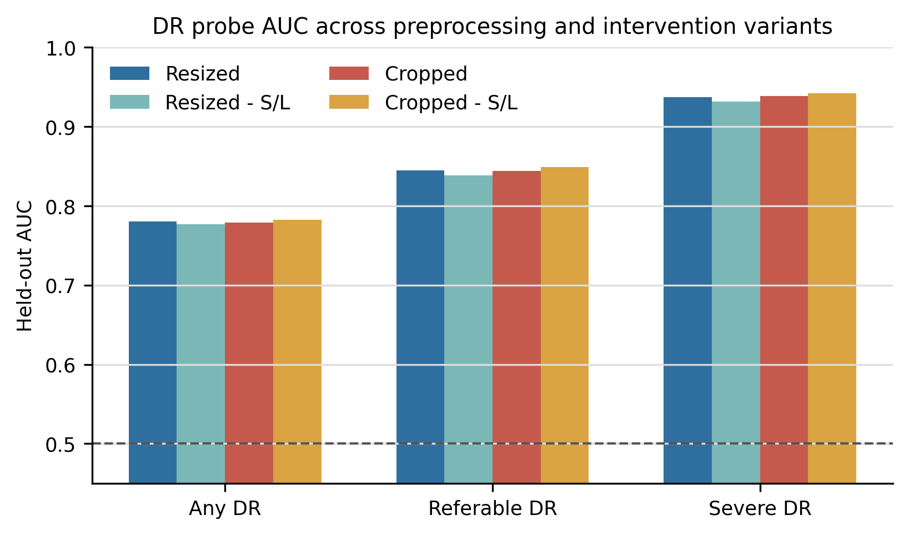
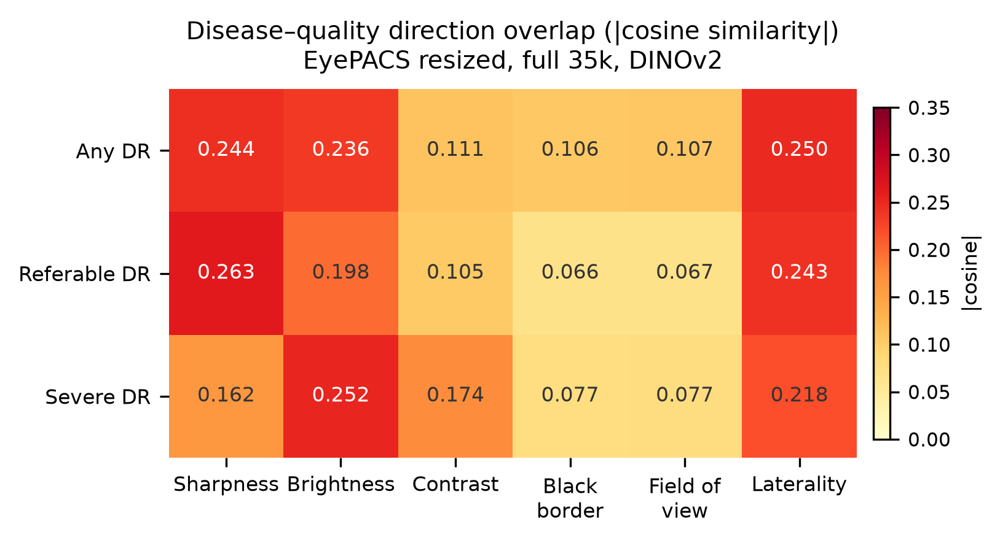
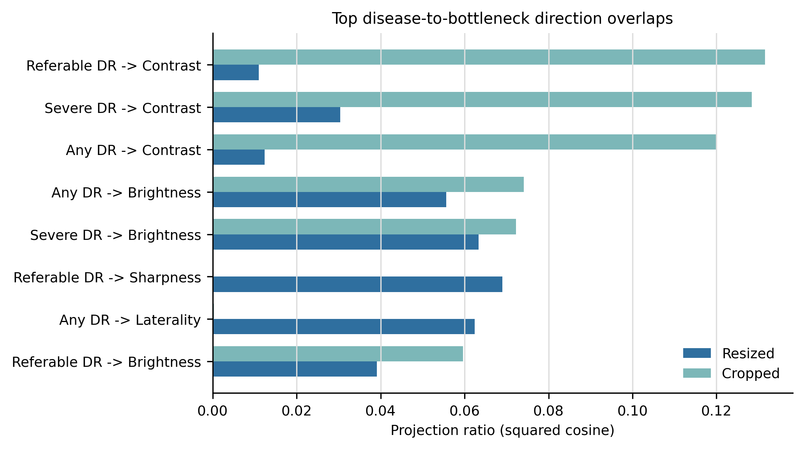
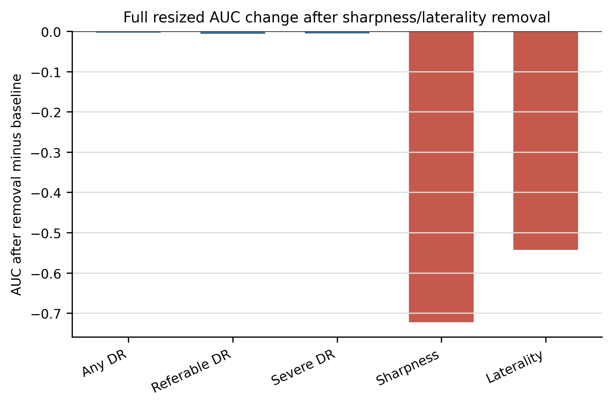

# Retina Subspace Audit

This repository contains a frozen-embedding audit for retinal fundus images. The
experiment asks a narrow question: when diabetic retinopathy signal is linearly
decodable from a foundation-model embedding, how much of that disease direction
overlaps with simple image-quality and preprocessing bottlenecks?

The project is not a diabetic retinopathy classifier benchmark. It is a
representation audit for finding shortcut structure before heavier modeling or
deployment work.

## What We Audited

We used 35,126 EyePACS-style fundus images with severity grades 0 to 4 and
embedded them with frozen DINOv2 ViT-B/14. Each image produced a 768-dimensional
feature vector. The audit compares three disease targets against six bottleneck
targets.

| Family | Targets |
| --- | --- |
| Disease | any DR, referable DR, severe DR |
| Quality and preprocessing | sharpness, brightness, contrast, black border, field of view, laterality |

Because the dataset does not include camera, site, photographer, demographic, or
clinical quality metadata, the bottleneck variables are pixel-derived proxies.
That keeps the audit cheap and reproducible, but it also limits the claims.

## Pipeline



The workflow is:

1. Validate the image manifest and labels.
2. Compute pixel-derived bottleneck features.
3. Extract frozen DINOv2 embeddings.
4. Train linear probes for disease and bottleneck targets.
5. Extract mean-difference disease and bottleneck directions.
6. Measure disease-to-bottleneck overlap with cosine and projection analyses.
7. Remove a selected bottleneck subspace and rerun the probes.

## Main Results

Frozen DINOv2 embeddings contain useful DR signal, but they also organize image
quality and anatomy very strongly. Probe AUC alone would miss that both kinds of
signal are present in the same representation.



| Target | Full resized DINOv2 AUC | Cropped DINOv2 AUC | Residualized resized AUC |
| --- | ---: | ---: | ---: |
| Any DR | 0.780 | 0.779 | 0.777 |
| Referable DR | 0.845 | 0.844 | 0.839 |
| Severe DR | 0.938 | 0.938 | 0.932 |

The disease directions are stable, but not cleanly separated from bottleneck
directions. In the full resized run, the any-DR direction has absolute cosine
0.244 with sharpness, 0.236 with brightness, and 0.250 with laterality.
Referable DR has its largest tested overlap with sharpness at 0.263. Severe DR
has its largest tested overlap with brightness at 0.252.



Projection ratios show the same pattern. Some disease axes place a measurable
fraction of their squared length along quality axes.



## What The Intervention Showed

We removed the rank-2 subspace spanned by sharpness and laterality directions
from the full resized embeddings, then reran the probe and direction audit.



| Target | Baseline AUC | Residualized AUC | Delta |
| --- | ---: | ---: | ---: |
| Any DR | 0.780 | 0.777 | -0.003 |
| Referable DR | 0.845 | 0.839 | -0.006 |
| Severe DR | 0.938 | 0.932 | -0.006 |
| Sharpness | 0.9996 | 0.277 | -0.723 |
| Laterality | 0.905 | 0.362 | -0.543 |

This does not prove causal deconfounding. It does show that selected
non-disease axes can be suppressed in embedding space with only a small loss in
DR probe performance. Brightness remains decodable after this targeted removal,
so the audit should be treated as an iterative diagnostic rather than a one-step
fix.

## Repository Layout

| Path | Purpose |
| --- | --- |
| `src/retina_audit/` | Reusable audit package |
| `scripts/` | Command-line stages for manifests, features, embeddings, probes, directions, and ablations |
| `configs/` | Dataset and model configs |
| `outputs/manifests/` | Audited dataset manifests and label summaries |
| `outputs/quality/` | Pixel-derived bottleneck features |
| `outputs/probes/` | Linear probe metrics and metadata |
| `outputs/directions/` | Direction vectors, cosine matrices, projection ratios, and stability summaries |
| `outputs/ablation/` | Residualized embedding metadata |
| `outputs/figures/submission/` | Summary figures used in this README |

## Setup

```bash
python -m venv .venv
source .venv/bin/activate
python -m pip install -r requirements.txt
python -m pip install -e .
```

Smoke check:

```bash
python -c "import retina_audit; print(retina_audit.__version__)"
python scripts/00_audit_dataset.py --help
```

## Reproducing The Audit

Raw medical images and large generated artifacts should not be committed to git.
Download the source EyePACS-style images separately, then set the local paths in
`configs/*.yaml`.

### 1. Audit the dataset manifest

```bash
python scripts/00_audit_dataset.py --config configs/eyepacs_resized_dinov2.yaml
```

Expected outputs:

- `outputs/manifests/image_manifest.parquet`
- `outputs/manifests/dataset_summary.json`
- `outputs/manifests/label_counts.csv`
- `outputs/manifests/missing_files.csv`
- `outputs/manifests/corrupt_images.csv`
- `outputs/manifests/filename_parse_report.json`

### 2. Compute bottleneck features

```bash
python scripts/01_compute_quality_features.py \
  --manifest outputs/manifests/image_manifest.parquet
```

Expected outputs:

- `outputs/quality/quality_features.parquet`
- `outputs/quality/quality_summary.json`
- `outputs/figures/quality/histograms/*.png`

### 3. Extract frozen embeddings

Local CPU smoke test:

```bash
python scripts/02_extract_embeddings.py \
  --config configs/eyepacs_resized_timm.yaml \
  --subset 8 \
  --allow-cpu
```

GPU run:

```bash
python scripts/02_extract_embeddings.py \
  --config configs/eyepacs_resized_dinov2.yaml \
  --subset all \
  --device cuda
```

Kaggle run with portable paths:

```bash
python scripts/02_extract_embeddings.py \
  --config configs/eyepacs_resized_dinov2.yaml \
  --manifest outputs/manifests/image_manifest.parquet \
  --image-root /kaggle/input/diabetic-retinopathy-resized \
  --subset all \
  --device cuda
```

Expected outputs:

- `outputs/embeddings/{dataset}_{model}_{preprocess}_embeddings.npy`
- `outputs/embeddings/{dataset}_{model}_{preprocess}_index.parquet`
- `outputs/embeddings/{dataset}_{model}_{preprocess}_meta.json`

### 4. Run disease and bottleneck probes

```bash
python scripts/04_run_probes.py \
  --embeddings outputs/embeddings/eyepacs_resized_dinov2_resized_full_embeddings.npy \
  --index outputs/embeddings/eyepacs_resized_dinov2_resized_full_index.parquet \
  --quality outputs/quality/quality_features.parquet \
  --output-prefix eyepacs_resized_dinov2_resized_full
```

Expected outputs:

- `outputs/probes/{run}_probe_metrics.csv`
- `outputs/probes/{run}_probe_coefficients.csv`
- `outputs/probes/{run}_probe_predictions.parquet`
- `outputs/probes/{run}_probe_meta.json`
- `outputs/tables/probe_metrics.csv`
- `outputs/tables/probe_comparison.csv`

### 5. Compute disease and bottleneck directions

```bash
python scripts/03_compute_directions.py \
  --embeddings outputs/embeddings/eyepacs_resized_dinov2_resized_full_embeddings.npy \
  --index outputs/embeddings/eyepacs_resized_dinov2_resized_full_index.parquet \
  --quality outputs/quality/quality_features.parquet \
  --output-prefix eyepacs_resized_dinov2_resized_full
```

Expected outputs:

- `outputs/directions/{run}_directions.npz`
- `outputs/directions/{run}_direction_summary.csv`
- `outputs/directions/{run}_cosine_matrix.csv`
- `outputs/directions/{run}_projection_ratios.csv`
- `outputs/directions/{run}_direction_stability.csv`
- `outputs/directions/{run}_direction_meta.json`
- `outputs/tables/cosine_matrix.csv`
- `outputs/tables/projection_ratios.csv`
- `outputs/tables/direction_stability.csv`

### 6. Run the residualization intervention

```bash
python scripts/05_run_ablation.py \
  --embeddings outputs/embeddings/eyepacs_resized_dinov2_resized_full_embeddings.npy \
  --index outputs/embeddings/eyepacs_resized_dinov2_resized_full_index.parquet \
  --directions outputs/directions/eyepacs_resized_dinov2_resized_full_directions.npz \
  --quality outputs/quality/quality_features.parquet \
  --baseline-prefix eyepacs_resized_dinov2_resized_full \
  --remove-directions sharpness laterality
```

Expected outputs:

- `outputs/ablation/{intervention_run}_embeddings.npy`
- `outputs/ablation/{intervention_run}_index.parquet`
- `outputs/ablation/{intervention_run}_ablation_meta.json`
- `outputs/tables/improvement_summary.csv`

## Artifact Sync

The repository is designed so raw images stay outside git. To mirror generated
artifacts through the Hugging Face dataset repo while preserving project-relative
paths:

```bash
python scripts/sync_hf_dataset.py upload \
  --repo-id mm2036/retina-representation-interpretability
```

On another machine:

```bash
python scripts/sync_hf_dataset.py download \
  --repo-id mm2036/retina-representation-interpretability
```

The sync includes processed artifacts under `outputs/manifests`,
`outputs/quality`, `outputs/embeddings`, `outputs/directions`,
`outputs/ablation`, `outputs/probes`, `outputs/tables`, and figure folders. Raw
images should come from the original Kaggle dataset.
